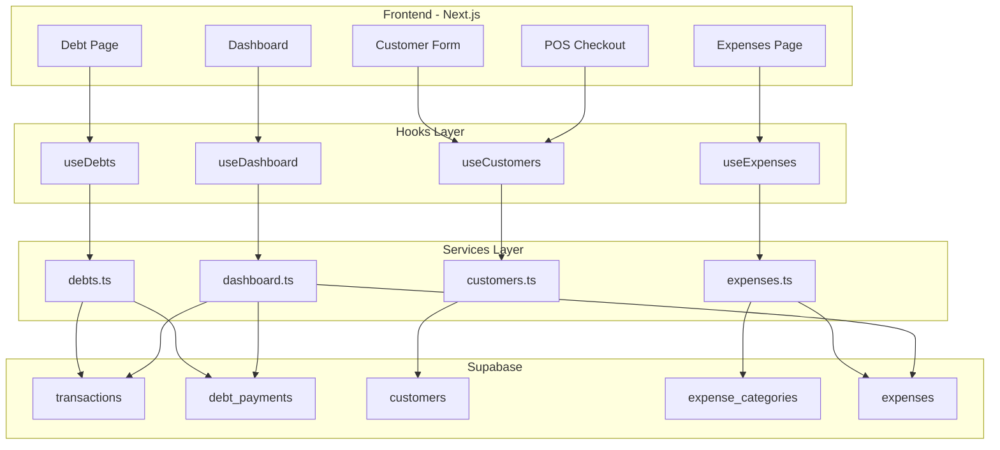

# Design Document: Debt Management & Expenses

## Overview

This feature adds comprehensive debt management, customer credit limits, and expense tracking to the POS system. It consists of three main components:

1. **Debt Management Page** - View, filter, and manage outstanding customer debts with payment recording
2. **Customer Credit System** - Credit approval and limit enforcement integrated into the existing customer and transaction flows
3. **Expenses Page** - Track business expenditures with categorization and reporting

The implementation leverages existing patterns (React Query hooks, Supabase services, component structure) and extends the current data model with new tables for debt payments, expense categories, and expenses.

## Architecture



## Components and Interfaces

### New Pages

| Route | Component | Description |
|-------|-----------|-------------|
| `/debts` | `DebtManagementPage` | Main debt management interface |
| `/expenses` | `ExpensesPage` | Expense tracking interface |

### New Components

```
components/
├── debts/
│   ├── DebtList.tsx           # List of debt transactions with filters
│   ├── DebtSummaryCards.tsx   # KPI cards (total, aging, collected)
│   ├── DebtPaymentDialog.tsx  # Modal for recording payments
│   ├── DebtDetailSheet.tsx    # Side panel showing debt details & history
│   └── CustomerDebtView.tsx   # Customer-grouped debt view
├── expenses/
│   ├── ExpenseList.tsx        # List of expenses with filters
│   ├── ExpenseForm.tsx        # Add/edit expense form
│   ├── ExpenseSummary.tsx     # Category breakdown summary
│   └── CategoryManager.tsx    # Manage expense categories
└── dashboard/
    └── DebtKPICards.tsx       # Debt KPIs for main dashboard
```

### Service Interfaces

```typescript
// lib/services/debts.ts
interface DebtFilters {
  search?: string
  dateFrom?: string
  dateTo?: string
  customerId?: string
  sortBy?: 'date' | 'amount' | 'customer' | 'daysOverdue'
  sortOrder?: 'asc' | 'desc'
  page?: number
  pageSize?: number
}

interface DebtTransaction {
  id: string
  transaction_number: string
  customer: Customer
  original_amount: number
  outstanding_balance: number
  days_overdue: number
  created_at: string
  payments: DebtPayment[]
}

interface DebtPayment {
  id: string
  transaction_id: string
  amount: number
  payment_method: 'cash' | 'mpesa' | 'bank'
  payment_date: string
  recorded_by: string
  recorded_by_user?: User
  created_at: string
}

interface DebtSummary {
  total_outstanding: number
  customer_count: number
  aging: {
    current: number      // 0-30 days
    overdue_30: number   // 31-60 days
    overdue_60: number   // 61-90 days
    overdue_90: number   // 90+ days
  }
  collected_this_month: number
  collected_today: number
}

// lib/services/expenses.ts
interface ExpenseCategory {
  id: string
  tenant_id: string
  name: string
  is_default: boolean
  created_at: string
}

interface Expense {
  id: string
  tenant_id: string
  category_id: string
  category?: ExpenseCategory
  amount: number
  description?: string
  receipt_reference?: string
  expense_date: string
  created_by: string
  created_by_user?: User
  created_at: string
  updated_at: string
}

interface ExpenseFilters {
  dateFrom?: string
  dateTo?: string
  categoryId?: string
  page?: number
  pageSize?: number
}

interface ExpenseSummary {
  total: number
  by_category: { category: string; amount: number }[]
}
```

### Customer Credit Extension

```typescript
// Extended Customer interface
interface Customer {
  // ... existing fields
  is_credit_approved: boolean
  credit_limit: number | null
  // Computed fields (from service)
  outstanding_debt?: number
  available_credit?: number
}
```

## Data Models

### Database Schema Changes

```sql
-- Add credit fields to customers table
ALTER TABLE customers ADD COLUMN is_credit_approved BOOLEAN DEFAULT false;
ALTER TABLE customers ADD COLUMN credit_limit DECIMAL(10,2) DEFAULT NULL;

-- Add outstanding_balance to transactions for tracking partial payments
ALTER TABLE transactions ADD COLUMN outstanding_balance DECIMAL(10,2);

-- Debt payments table
CREATE TABLE debt_payments (
  id UUID PRIMARY KEY DEFAULT gen_random_uuid(),
  tenant_id UUID NOT NULL REFERENCES tenants(id),
  transaction_id UUID NOT NULL REFERENCES transactions(id),
  amount DECIMAL(10,2) NOT NULL,
  payment_method VARCHAR(20) NOT NULL CHECK (payment_method IN ('cash', 'mpesa', 'bank')),
  payment_date TIMESTAMP WITH TIME ZONE DEFAULT NOW(),
  recorded_by UUID NOT NULL REFERENCES users(id),
  created_at TIMESTAMP WITH TIME ZONE DEFAULT NOW()
);

-- Expense categories table
CREATE TABLE expense_categories (
  id UUID PRIMARY KEY DEFAULT gen_random_uuid(),
  tenant_id UUID NOT NULL REFERENCES tenants(id),
  name VARCHAR(100) NOT NULL,
  is_default BOOLEAN DEFAULT false,
  created_at TIMESTAMP WITH TIME ZONE DEFAULT NOW(),
  UNIQUE(tenant_id, name)
);

-- Expenses table
CREATE TABLE expenses (
  id UUID PRIMARY KEY DEFAULT gen_random_uuid(),
  tenant_id UUID NOT NULL REFERENCES tenants(id),
  category_id UUID NOT NULL REFERENCES expense_categories(id),
  amount DECIMAL(10,2) NOT NULL,
  description TEXT,
  receipt_reference VARCHAR(100),
  expense_date DATE NOT NULL,
  created_by UUID NOT NULL REFERENCES users(id),
  created_at TIMESTAMP WITH TIME ZONE DEFAULT NOW(),
  updated_at TIMESTAMP WITH TIME ZONE DEFAULT NOW()
);

-- Expense audit trail
CREATE TABLE expense_audit (
  id UUID PRIMARY KEY DEFAULT gen_random_uuid(),
  expense_id UUID NOT NULL REFERENCES expenses(id),
  changed_by UUID NOT NULL REFERENCES users(id),
  changes JSONB NOT NULL,
  created_at TIMESTAMP WITH TIME ZONE DEFAULT NOW()
);

-- RLS Policies
ALTER TABLE debt_payments ENABLE ROW LEVEL SECURITY;
ALTER TABLE expense_categories ENABLE ROW LEVEL SECURITY;
ALTER TABLE expenses ENABLE ROW LEVEL SECURITY;
ALTER TABLE expense_audit ENABLE ROW LEVEL SECURITY;

-- Tenant isolation policies (similar to existing tables)
CREATE POLICY "Tenant isolation" ON debt_payments
  FOR ALL USING (tenant_id = current_setting('app.tenant_id')::uuid);

CREATE POLICY "Tenant isolation" ON expense_categories
  FOR ALL USING (tenant_id = current_setting('app.tenant_id')::uuid);

CREATE POLICY "Tenant isolation" ON expenses
  FOR ALL USING (tenant_id = current_setting('app.tenant_id')::uuid);

CREATE POLICY "Tenant isolation" ON expense_audit
  FOR ALL USING (expense_id IN (SELECT id FROM expenses WHERE tenant_id = current_setting('app.tenant_id')::uuid));
```

### TypeScript Types

```typescript
// types/index.ts additions

export interface DebtPayment {
  id: string
  tenant_id: string
  transaction_id: string
  amount: number
  payment_method: 'cash' | 'mpesa' | 'bank'
  payment_date: string
  recorded_by: string
  recorded_by_user?: User
  created_at: string
}

export interface ExpenseCategory {
  id: string
  tenant_id: string
  name: string
  is_default: boolean
  created_at: string
}

export interface Expense {
  id: string
  tenant_id: string
  category_id: string
  category?: ExpenseCategory
  amount: number
  description?: string
  receipt_reference?: string
  expense_date: string
  created_by: string
  created_by_user?: User
  created_at: string
  updated_at: string
}

export interface ExpenseAudit {
  id: string
  expense_id: string
  changed_by: string
  changes: Record<string, { old: unknown; new: unknown }>
  created_at: string
}
```

## Correctness Properties

*A property is a characteristic or behavior that should hold true across all valid executions of a system-essentially, a formal statement about what the system should do. Properties serve as the bridge between human-readable specifications and machine-verifiable correctness guarantees.*

Based on the prework analysis, the following correctness properties have been identified:

### Property 1: Debt list shows only pending debts
*For any* set of transactions with mixed statuses, the debt list SHALL return only transactions where status equals 'debt_pending'.
**Validates: Requirements 1.1**

### Property 2: Debt display contains required fields
*For any* debt transaction, the rendered display SHALL contain customer name, transaction date, original amount, outstanding balance, and days overdue.
**Validates: Requirements 1.2**

### Property 3: Search filter returns matching results
*For any* debt list and search query, all returned results SHALL have customer name or transaction number containing the search term.
**Validates: Requirements 1.3**

### Property 4: Date filter returns debts within range
*For any* debt list and date range filter, all returned debts SHALL have created_at within the specified date range.
**Validates: Requirements 1.4**

### Property 5: Sort order is correct
*For any* debt list and sort configuration, the returned list SHALL be ordered correctly by the specified field and direction.
**Validates: Requirements 1.5**

### Property 6: Payment updates balance correctly
*For any* debt with outstanding balance B and payment amount P where P <= B, after recording the payment the new outstanding balance SHALL equal B - P, and status SHALL be 'completed' if B - P equals 0, otherwise 'debt_pending'.
**Validates: Requirements 2.2, 2.3**

### Property 7: Overpayment is rejected
*For any* debt with outstanding balance B and payment amount P where P > B, the payment SHALL be rejected with a validation error.
**Validates: Requirements 2.4**

### Property 8: Payment history is chronologically ordered
*For any* debt with multiple payments, the payment history SHALL be ordered by payment_date in ascending order.
**Validates: Requirements 3.1**

### Property 9: Balance calculation is correct
*For any* debt with original amount A and payments totaling T, the displayed remaining balance SHALL equal A - T.
**Validates: Requirements 3.3**

### Property 10: Total outstanding debt is sum of all balances
*For any* set of pending debts, the total outstanding debt SHALL equal the sum of all individual outstanding balances.
**Validates: Requirements 4.1, 8.1**

### Property 11: Debt aging categorization is correct
*For any* debt with age D days, it SHALL be categorized as: current (D <= 30), overdue_30 (31 <= D <= 60), overdue_60 (61 <= D <= 90), or overdue_90 (D > 90).
**Validates: Requirements 4.3**

### Property 12: Customer debt grouping is accurate
*For any* customer with debts, the customer view SHALL show total outstanding equal to sum of their individual debt balances.
**Validates: Requirements 5.2**

### Property 13: Debt payment serialization round-trip
*For any* valid DebtPayment object, serializing to JSON and deserializing back SHALL produce an equivalent object.
**Validates: Requirements 6.2, 6.3**

### Property 14: Credit approval requires positive limit
*For any* customer marked as credit approved, the credit limit SHALL be greater than zero.
**Validates: Requirements 7.2**

### Property 15: Credit sale blocked for non-approved customers
*For any* customer not marked as credit approved, attempting a credit sale SHALL be rejected.
**Validates: Requirements 7.3**

### Property 16: Credit limit enforcement
*For any* credit-approved customer with credit limit L and outstanding debt D, a credit sale of amount A SHALL be blocked if D + A > L.
**Validates: Requirements 7.4**

### Property 17: Available credit calculation
*For any* credit-approved customer with credit limit L and outstanding debt D, the available credit SHALL equal L - D.
**Validates: Requirements 7.5**

### Property 18: Overdue customer count is accurate
*For any* set of debts, the overdue customer count SHALL equal the distinct count of customers with at least one debt older than 30 days.
**Validates: Requirements 8.2**

### Property 19: Expense required fields validation
*For any* expense creation attempt missing category, amount, or date, the creation SHALL be rejected with a validation error.
**Validates: Requirements 9.2**

### Property 20: Expense category filter returns matching results
*For any* expense list and category filter, all returned expenses SHALL have the specified category.
**Validates: Requirements 9.4**

### Property 21: Expense category totals are correct
*For any* set of expenses, the category summary totals SHALL equal the sum of expenses in each category.
**Validates: Requirements 9.5**

### Property 22: Category name uniqueness
*For any* tenant, attempting to create a category with a name that already exists SHALL be rejected.
**Validates: Requirements 10.2**

### Property 23: Category deletion protection
*For any* category with existing expenses, deletion SHALL be prevented.
**Validates: Requirements 10.3**

### Property 24: Expense serialization round-trip
*For any* valid Expense object, serializing to JSON and deserializing back SHALL produce an equivalent object.
**Validates: Requirements 11.2, 11.3**

### Property 25: Expense edit creates audit trail
*For any* expense edit operation, an audit record SHALL be created capturing the changes.
**Validates: Requirements 11.4**

## Error Handling

| Scenario | Handling |
|----------|----------|
| Payment exceeds balance | Display validation error, prevent submission |
| Credit limit exceeded | Display warning with available credit, block transaction |
| Non-approved customer credit sale | Display error, suggest cash payment |
| Category deletion with expenses | Display warning, prevent deletion |
| Database operation failure | Display toast error, maintain previous state |
| Network timeout | Display retry option, preserve form data |
| Invalid expense data | Display field-level validation errors |

## Testing Strategy

### Unit Testing
- Test validation functions (payment amount, credit limit, expense fields)
- Test calculation functions (outstanding balance, available credit, aging)
- Test filter/sort logic in isolation
- Use Vitest with React Testing Library for component tests

### Property-Based Testing
- Use **fast-check** library for property-based testing in Vitest
- Configure minimum 100 iterations per property test
- Each property test MUST be tagged with: `**Feature: debt-management, Property {number}: {property_text}**`
- Focus on:
  - Balance calculations after payments
  - Credit limit enforcement logic
  - Filtering and sorting correctness
  - Serialization round-trips
  - Aggregation accuracy

### Integration Testing
- Test Supabase service functions with test database
- Verify RLS policies work correctly
- Test real-time subscription updates

### E2E Testing
- Use Playwright for critical user flows:
  - Recording a debt payment
  - Creating an expense
  - Credit limit blocking a sale
