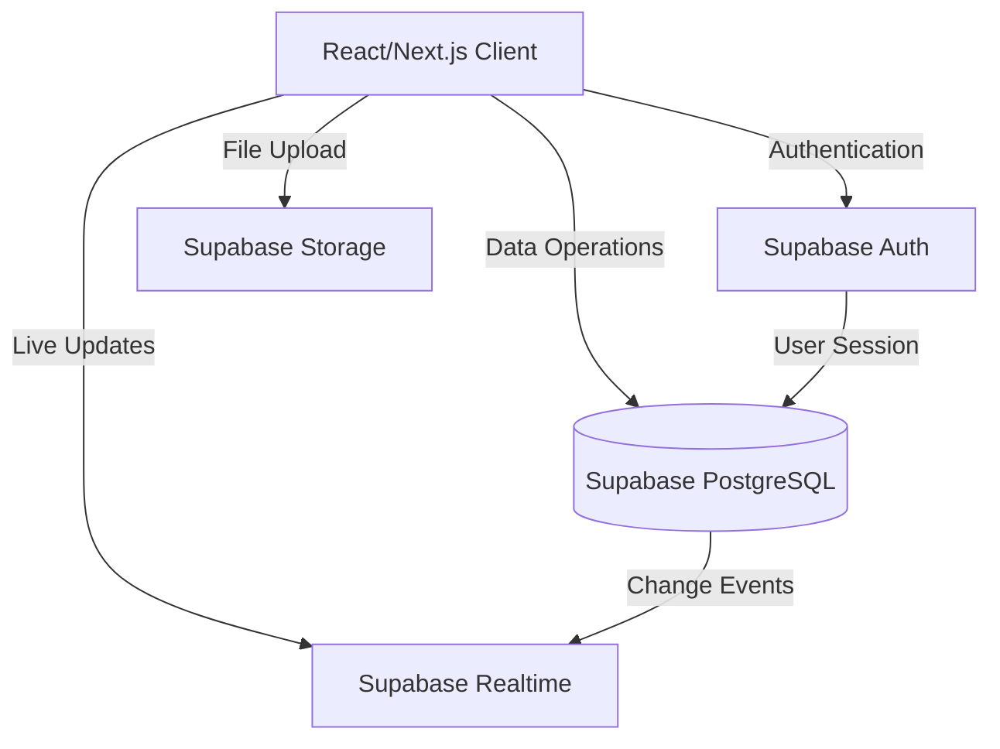

# Design Document - Restaurant POS System

## Overview

The Restaurant POS System is a multi-tenant web application built with React/Next.js and Supabase. It provides comprehensive business management capabilities including inventory control, sales transactions, purchase order tracking, returns management, and user administration. The system enforces role-based access control with Admin and Sales Person roles, ensuring data security and appropriate feature access.

### Technology Stack

- **Frontend**: React 18+ with Next.js 14 (App Router)
- **UI Framework**: shadcn/ui with Tailwind CSS
- **Backend**: Supabase (PostgreSQL database, Authentication, Real-time subscriptions)
- **State Management**: React Context API + React Query for server state
- **Forms**: React Hook Form with Zod validation
- **Charts**: Recharts for dashboard analytics
- **PWA**: next-pwa for Progressive Web App capabilities

## Architecture

### High-Level Architecture



### Multi-Tenant Architecture

The system implements tenant isolation at the database level using Row Level Security (RLS) policies in Supabase:

1. Each user belongs to a single tenant (organization)
2. All data tables include a `tenant_id` column
3. RLS policies automatically filter queries based on the authenticated user's tenant
4. Supabase Auth manages user sessions and provides the tenant context

### Application Layers

```
┌─────────────────────────────────────┐
│         Presentation Layer          │
│  (Pages, Components, UI)            │
└─────────────────────────────────────┘
           ↓
┌─────────────────────────────────────┐
│         Business Logic Layer        │
│  (Hooks, Services, Validation)      │
└─────────────────────────────────────┘
           ↓
┌─────────────────────────────────────┐
│         Data Access Layer           │
│  (Supabase Client, API calls)       │
└─────────────────────────────────────┘
           ↓
┌─────────────────────────────────────┐
│         Supabase Backend            │
│  (Database, Auth, Realtime)         │
└─────────────────────────────────────┘
```

## Database Schema

### Core Tables

#### tenants
```sql
- id: uuid (PK)
- name: text
- created_at: timestamp
- settings: jsonb (business settings, low stock threshold, etc.)
```

#### users (extends Supabase auth.users)
```sql
- id: uuid (PK, references auth.users)
- tenant_id: uuid (FK to tenants)
- email: text
- full_name: text
- role: enum ('admin', 'sales_person')
- created_at: timestamp
- updated_at: timestamp
```

#### products
```sql
- id: uuid (PK)
- tenant_id: uuid (FK to tenants)
- sku: text (unique per tenant)
- name: text
- description: text
- category: text
- price: decimal
- cost: decimal (for profit calculation)
- base_unit: text (e.g., 'piece', 'kg')
- purchase_unit: text
- unit_conversion_ratio: decimal
- stock_quantity: decimal
- low_stock_threshold: decimal
- is_archived: boolean
- created_at: timestamp
- updated_at: timestamp
- created_by: uuid (FK to users)
```

#### stock_history
```sql
- id: uuid (PK)
- tenant_id: uuid (FK to tenants)
- product_id: uuid (FK to products)
- type: enum ('restock', 'adjustment', 'sale', 'return')
- quantity_change: decimal
- quantity_after: decimal
- reason: text
- reference_id: uuid (transaction or purchase order ID)
- created_at: timestamp
- created_by: uuid (FK to users)
```

#### customers
```sql
- id: uuid (PK)
- tenant_id: uuid (FK to tenants)
- name: text
- phone: text
- email: text
- total_purchases: decimal
- created_at: timestamp
- updated_at: timestamp
```

#### transactions
```sql
- id: uuid (PK)
- tenant_id: uuid (FK to tenants)
- transaction_number: text (unique per tenant)
- customer_id: uuid (FK to customers, nullable)
- subtotal: decimal
- discount_type: enum ('percentage', 'fixed')
- discount_value: decimal
- discount_amount: decimal
- total: decimal
- payment_method: enum ('cash', 'mpesa', 'bank', 'debt')
- status: enum ('completed', 'debt_pending')
- created_at: timestamp
- created_by: uuid (FK to users)
```

#### transaction_items
```sql
- id: uuid (PK)
- tenant_id: uuid (FK to tenants)
- transaction_id: uuid (FK to transactions)
- product_id: uuid (FK to products)
- product_name: text (snapshot)
- product_sku: text (snapshot)
- quantity: decimal
- unit_price: decimal
- subtotal: decimal
- created_at: timestamp
```

#### purchase_orders
```sql
- id: uuid (PK)
- tenant_id: uuid (FK to tenants)
- po_number: text (unique per tenant)
- supplier_name: text
- supplier_contact: text
- status: enum ('draft', 'ordered', 'received', 'completed')
- expected_delivery_date: date
- total_cost: decimal
- notes: text
- created_at: timestamp
- updated_at: timestamp
- created_by: uuid (FK to users)
```

#### purchase_order_items
```sql
- id: uuid (PK)
- tenant_id: uuid (FK to tenants)
- purchase_order_id: uuid (FK to purchase_orders)
- product_id: uuid (FK to products)
- product_name: text (snapshot)
- quantity: decimal
- cost_per_unit: decimal
- total_cost: decimal
- created_at: timestamp
```

#### returns
```sql
- id: uuid (PK)
- tenant_id: uuid (FK to tenants)
- return_number: text (unique per tenant)
- transaction_id: uuid (FK to transactions)
- reason: text
- status: enum ('pending', 'approved', 'rejected')
- total_amount: decimal
- approved_at: timestamp
- approved_by: uuid (FK to users, nullable)
- created_at: timestamp
- created_by: uuid (FK to users)
```

#### return_items
```sql
- id: uuid (PK)
- tenant_id: uuid (FK to tenants)
- return_id: uuid (FK to returns)
- transaction_item_id: uuid (FK to transaction_items)
- product_id: uuid (FK to products)
- product_name: text (snapshot)
- quantity: decimal
- unit_price: decimal
- subtotal: decimal
- created_at: timestamp
```

### Indexes

Key indexes for performance:
- `products(tenant_id, sku)`
- `products(tenant_id, is_archived, stock_quantity)` for low stock queries
- `transactions(tenant_id, created_at DESC)`
- `transactions(tenant_id, payment_method, created_at)`
- `purchase_orders(tenant_id, status, expected_delivery_date)`
- `stock_history(tenant_id, product_id, created_at DESC)`

### Row Level Security (RLS) Policies

All tables will have RLS enabled with policies:

1. **SELECT**: Users can only see data where `tenant_id` matches their tenant
2. **INSERT**: Users can only insert data with their own `tenant_id`
3. **UPDATE**: Users can only update data where `tenant_id` matches their tenant
4. **DELETE**: Only admins can delete, and only within their tenant

Example policy for products table:
```sql
CREATE POLICY "Users can view their tenant's products"
ON products FOR SELECT
USING (tenant_id = auth.jwt() ->> 'tenant_id');

CREATE POLICY "Admins can insert products"
ON products FOR INSERT
WITH CHECK (
  tenant_id = auth.jwt() ->> 'tenant_id' AND
  auth.jwt() ->> 'role' = 'admin'
);
```

## Components and Interfaces

### Page Structure

```
/
├── (auth)
│   ├── login
│   └── setup (initial tenant setup)
├── (dashboard)
│   ├── dashboard (admin only)
│   ├── pos
│   ├── inventory (admin only)
│   ├── transactions
│   ├── purchase-orders (admin only)
│   ├── returns
│   └── users (admin only)
└── settings
```

### Key Components

#### Layout Components

**AppLayout**
- Sidebar navigation with role-based menu items
- Header with user profile, theme toggle, and logout
- Responsive drawer for mobile
- Breadcrumb navigation

**ProtectedRoute**
- Checks authentication status
- Verifies user role for admin-only pages
- Redirects to login if unauthenticated

#### Dashboard Components (Admin Only)

**DashboardKPIs**
- Revenue card with trend indicator
- Profit card with margin percentage
- Sales count card
- Low stock alerts card with quick actions

**SalesTrendChart**
- Line/bar chart showing sales over time
- Date range selector (7 days, 30 days, 90 days, custom)
- Toggle between revenue and sales count

**LowStockTable**
- List of products below threshold
- Quick restock button
- Link to product details

#### Inventory Components (Admin Only)

**ProductList**
- Data table with sorting and filtering
- Search by name/SKU with debouncing
- Category filter dropdown
- Pagination controls
- Bulk actions (export CSV, archive)

**ProductForm**
- Create/edit product modal
- Form fields: SKU, name, category, description, price, cost, units, stock
- Validation with Zod schema
- Image upload (optional)

**StockAdjustmentModal**
- Restock or adjust stock quantity
- Reason field for adjustments
- Real-time stock calculation

**StockHistoryDrawer**
- Timeline view of stock changes
- Filter by type (restock, adjustment, sale, return)
- Pagination for large histories

#### POS Components

**ProductSearch**
- Autocomplete search with fuzzy matching
- Barcode scanner integration (using device camera)
- Product grid with load-more pagination

**Cart**
- Line items with quantity controls
- Discount input (percentage or fixed)
- Subtotal and total calculation
- Clear cart button

**CheckoutModal**
- Customer selection/creation
- Payment method selector
- Amount tendered and change calculation (for cash)
- Complete sale button
- Receipt preview

**ReceiptPrint**
- Printable receipt template
- Business info, transaction details, items
- QR code for digital receipt (optional)

#### Transaction Components

**TransactionList**
- Data table with filters (date range, payment method)
- Search by customer or transaction number
- Export to CSV button
- Pagination

**TransactionDetails**
- Modal/drawer showing full transaction
- Itemized list with quantities and prices
- Payment information
- Reprint receipt button
- Create return button

#### Purchase Order Components (Admin Only)

**PurchaseOrderList**
- Data table with status filters
- Date range filter
- Total cost column
- Status badges

**PurchaseOrderForm**
- Create/edit PO modal
- Supplier information fields
- Line items with product selector
- Quantity and cost per unit inputs
- Expected delivery date picker
- Total cost calculation

**PurchaseOrderDetails**
- View PO information
- Status update buttons (Draft → Ordered → Received → Completed)
- Option to create inventory restock from received PO
- Edit and delete actions

#### Returns Components

**ReturnsList**
- Data table with status filters
- Search by return number or customer
- Pagination

**CreateReturnModal**
- Transaction selector
- Select items to return with quantities
- Reason text area
- Submit for approval

**ReturnApprovalCard** (Admin Only)
- Return details display
- Approve/reject buttons
- Approval reason field

#### User Management Components (Admin Only)

**UserList**
- Data table with role filters
- Search by name or email
- Pagination

**UserForm**
- Create/edit user modal
- Fields: email, full name, role, password
- Password strength indicator
- Role selector with descriptions

**ChangePasswordModal**
- Current password (for self)
- New password with confirmation
- Validation rules display

### Shared Components

**DataTable**
- Reusable table with sorting, filtering, pagination
- Column configuration
- Row actions menu

**SearchInput**
- Debounced search with clear button
- Loading indicator

**DateRangePicker**
- Preset ranges (Today, Week, Month, Custom, All)
- Calendar popup for custom range

**ConfirmDialog**
- Reusable confirmation modal
- Customizable title, message, and actions

**ThemeToggle**
- Switch between light and dark themes
- Persists preference to localStorage

## Data Models

### TypeScript Interfaces

```typescript
interface Tenant {
  id: string;
  name: string;
  created_at: string;
  settings: {
    low_stock_threshold: number;
    currency: string;
    tax_rate?: number;
  };
}

interface User {
  id: string;
  tenant_id: string;
  email: string;
  full_name: string;
  role: 'admin' | 'sales_person';
  created_at: string;
  updated_at: string;
}

interface Product {
  id: string;
  tenant_id: string;
  sku: string;
  name: string;
  description: string;
  category: string;
  price: number;
  cost: number;
  base_unit: string;
  purchase_unit: string;
  unit_conversion_ratio: number;
  stock_quantity: number;
  low_stock_threshold: number;
  is_archived: boolean;
  created_at: string;
  updated_at: string;
  created_by: string;
}

interface StockHistory {
  id: string;
  tenant_id: string;
  product_id: string;
  type: 'restock' | 'adjustment' | 'sale' | 'return';
  quantity_change: number;
  quantity_after: number;
  reason: string;
  reference_id?: string;
  created_at: string;
  created_by: string;
  user?: User;
  product?: Product;
}

interface Customer {
  id: string;
  tenant_id: string;
  name: string;
  phone?: string;
  email?: string;
  total_purchases: number;
  created_at: string;
  updated_at: string;
}

interface Transaction {
  id: string;
  tenant_id: string;
  transaction_number: string;
  customer_id?: string;
  customer?: Customer;
  subtotal: number;
  discount_type: 'percentage' | 'fixed';
  discount_value: number;
  discount_amount: number;
  total: number;
  payment_method: 'cash' | 'mpesa' | 'bank' | 'debt';
  status: 'completed' | 'debt_pending';
  created_at: string;
  created_by: string;
  items: TransactionItem[];
}

interface TransactionItem {
  id: string;
  tenant_id: string;
  transaction_id: string;
  product_id: string;
  product_name: string;
  product_sku: string;
  quantity: number;
  unit_price: number;
  subtotal: number;
  created_at: string;
}

interface PurchaseOrder {
  id: string;
  tenant_id: string;
  po_number: string;
  supplier_name: string;
  supplier_contact?: string;
  status: 'draft' | 'ordered' | 'received' | 'completed';
  expected_delivery_date: string;
  total_cost: number;
  notes?: string;
  created_at: string;
  updated_at: string;
  created_by: string;
  items: PurchaseOrderItem[];
}

interface PurchaseOrderItem {
  id: string;
  tenant_id: string;
  purchase_order_id: string;
  product_id: string;
  product_name: string;
  quantity: number;
  cost_per_unit: number;
  total_cost: number;
  created_at: string;
}

interface Return {
  id: string;
  tenant_id: string;
  return_number: string;
  transaction_id: string;
  transaction?: Transaction;
  reason: string;
  status: 'pending' | 'approved' | 'rejected';
  total_amount: number;
  approved_at?: string;
  approved_by?: string;
  created_at: string;
  created_by: string;
  items: ReturnItem[];
}

interface ReturnItem {
  id: string;
  tenant_id: string;
  return_id: string;
  transaction_item_id: string;
  product_id: string;
  product_name: string;
  quantity: number;
  unit_price: number;
  subtotal: number;
  created_at: string;
}
```

## State Management

### Authentication State

Managed by Supabase Auth with React Context:

```typescript
interface AuthContextType {
  user: User | null;
  tenant: Tenant | null;
  session: Session | null;
  loading: boolean;
  signIn: (email: string, password: string) => Promise<void>;
  signOut: () => Promise<void>;
  changePassword: (newPassword: string) => Promise<void>;
}
```

### Server State

Managed by React Query (TanStack Query):

- Automatic caching and revalidation
- Optimistic updates for mutations
- Background refetching
- Query invalidation on mutations

Key query keys:
- `['products', tenantId, filters]`
- `['transactions', tenantId, filters]`
- `['purchase-orders', tenantId, filters]`
- `['dashboard-kpis', tenantId, dateRange]`
- `['stock-history', productId]`

### Local State

- Cart state: localStorage + React Context
- Theme preference: localStorage
- Form state: React Hook Form
- UI state: Component-level useState

## Error Handling

### Error Types

1. **Authentication Errors**: Invalid credentials, session expired
2. **Authorization Errors**: Insufficient permissions
3. **Validation Errors**: Invalid form data
4. **Database Errors**: Constraint violations, connection issues
5. **Network Errors**: Timeout, offline

### Error Handling Strategy

**Frontend**:
- Try-catch blocks around async operations
- Error boundaries for component errors
- Toast notifications for user-facing errors
- Form validation errors displayed inline
- Retry logic for transient network errors

**Backend (Supabase)**:
- RLS policies return empty results for unauthorized access
- Database constraints prevent invalid data
- Triggers for complex validation

### Error Messages

- User-friendly messages for common errors
- Technical details logged to console in development
- Error tracking service integration (e.g., Sentry) for production

## Testing Strategy

### Unit Tests

**Target**: Business logic, utility functions, validation schemas

Tools: Vitest, Testing Library

Examples:
- Price calculation functions
- Discount application logic
- Unit conversion calculations
- Form validation schemas
- Date formatting utilities

### Integration Tests

**Target**: Component interactions, data flow

Tools: Vitest, Testing Library, MSW (Mock Service Worker)

Examples:
- POS checkout flow
- Product creation and stock update
- Transaction filtering and search
- Purchase order status transitions

### End-to-End Tests

**Target**: Critical user flows

Tools: Playwright

Examples:
- Complete sale from product search to receipt
- Admin creating user and assigning role
- Purchase order creation and completion
- Return approval workflow

### Testing Priorities

1. **Critical**: POS checkout, inventory updates, authentication
2. **High**: Dashboard calculations, transaction management
3. **Medium**: Purchase orders, returns, user management
4. **Low**: UI theme switching, CSV exports

## Security Considerations

### Authentication & Authorization

- Supabase Auth handles password hashing and session management
- JWT tokens with short expiration (1 hour)
- Refresh tokens for session renewal
- Role-based access control enforced at database level with RLS
- Admin-only routes protected with middleware

### Data Security

- All data encrypted in transit (HTTPS)
- Database encryption at rest (Supabase default)
- Tenant isolation via RLS policies
- No sensitive data in localStorage (only cart items)
- SQL injection prevention via parameterized queries

### Input Validation

- Client-side validation with Zod schemas
- Server-side validation via database constraints
- XSS prevention via React's automatic escaping
- CSRF protection via Supabase Auth tokens

### Audit Trail

- All data modifications tracked with timestamps and user IDs
- Stock history maintains complete audit trail
- Transaction and return records immutable after creation

## Performance Optimization

### Database Optimization

- Proper indexing on frequently queried columns
- Pagination for large datasets
- Materialized views for dashboard KPIs (if needed)
- Connection pooling via Supabase

### Frontend Optimization

- Code splitting by route
- Lazy loading for heavy components
- Image optimization with Next.js Image component
- Debounced search inputs
- Virtual scrolling for large lists (if needed)
- React Query caching reduces API calls

### Caching Strategy

- React Query cache: 5 minutes for most data
- Aggressive caching for static data (products, categories)
- Stale-while-revalidate for dashboard metrics
- localStorage for cart persistence

### Bundle Size

- Tree-shaking unused code
- Dynamic imports for large dependencies
- Minimize third-party libraries
- Use shadcn/ui (copy components, not full library)

## Deployment & DevOps

### Environment Setup

**Development**:
- Local Supabase instance (optional) or dev project
- Environment variables in `.env.local`
- Hot reload with Next.js dev server

**Staging**:
- Separate Supabase project
- Deployed to Vercel preview environment
- Test data seeding scripts

**Production**:
- Production Supabase project
- Deployed to Vercel
- CDN for static assets
- Database backups enabled

### CI/CD Pipeline

1. **Lint & Type Check**: ESLint, TypeScript
2. **Unit Tests**: Vitest
3. **Build**: Next.js production build
4. **Deploy**: Automatic deployment to Vercel on main branch
5. **E2E Tests**: Playwright tests on staging

### Monitoring

- Vercel Analytics for performance metrics
- Supabase Dashboard for database metrics
- Error tracking with Sentry (optional)
- Uptime monitoring

## Progressive Web App (PWA)

### PWA Features

- Installable on desktop and mobile
- App icon and splash screen
- Standalone display mode
- Service worker for asset caching (basic)

### Manifest Configuration

```json
{
  "name": "Restaurant POS",
  "short_name": "POS",
  "description": "Point of Sale system for restaurants",
  "start_url": "/",
  "display": "standalone",
  "background_color": "#ffffff",
  "theme_color": "#000000",
  "icons": [
    {
      "src": "/icon-192.png",
      "sizes": "192x192",
      "type": "image/png"
    },
    {
      "src": "/icon-512.png",
      "sizes": "512x512",
      "type": "image/png"
    }
  ]
}
```

### Service Worker

- Cache static assets (JS, CSS, images)
- Network-first strategy for API calls
- No offline transaction support (future enhancement)

## Future Enhancements

Potential features for future iterations:

1. **Offline Mode**: Queue transactions when offline, sync when online
2. **Customer Orders**: Track dine-in/takeout orders with kitchen display
3. **Multi-location**: Support for multiple restaurant locations
4. **Advanced Reporting**: Custom reports, profit/loss statements
5. **Loyalty Program**: Customer points and rewards
6. **Supplier Management**: Detailed supplier profiles and order history
7. **Recipe Management**: Track ingredients and calculate food costs
8. **Employee Time Tracking**: Clock in/out and shift management
9. **Table Management**: For dine-in restaurants
10. **Mobile App**: Native iOS/Android apps with React Native
